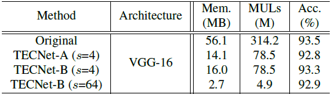

## Full-Stack Filters
Code for Paper: [Full-Stack Filters to Build Minimum Viable CNNs (MVNet)](https://arxiv.org/abs/1908.02023)

### Description
- MVNet with Full-Stack Filters inference code on CIFAR-10 dataset.
- We provide the trained model in `models/cifar10-s64.th` which occupies 15 MB, including `1.0 MB` `float32` weights and `14.0 MB` binary masks stored in `int8` format (so it's `1.75 MB` in `bool` format which is not supported in PyTorch yet).

### Files description
Requirements: Python 3.6, PyTorch 0.4

- `MaskConv2d` in `mask_conv.py` is the new convolution class with full-stack filters used for replacing `nn.Conv2d`.
- `mask_vgg.py` is the VGG-16 using the proposed full-stack filters.
- `test.py` is the test script on CIFAR-10 dataset.

### Usage
1. Download CIFAR-10 python version from [cifar-10-python.tar.gz](https://www.cs.toronto.edu/~kriz/cifar-10-python.tar.gz), put it in anywhere you like such as `$data/cifar-10-python.tar.gz`. 
2. Run `python test.py --resume=models/cifar10-s64.th --data-dir=$data` in default setting, you will get `93.1%` accuracy.

### Performance
Performance on CIFAR-10 with VGG-16 as architecture:



For other experimental results, please refer to the original paper.

### Citation
If you use these models in your research, please cite:
```
@article{han2019full,
  title={Full-Stack Filters to Build Minimum Viable CNNs},
  author={Han, Kai and Wang, Yunhe and Xu, Yixing and Xu, Chunjing and Tao, Dacheng and Xu, Chang},
  journal={arXiv preprint arXiv:1908.02023},
  year={2019}
}
```
